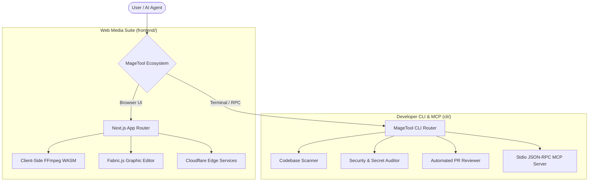

# 🧙‍♂️ MageTool

<div align="center">

[](LICENSE)
[](https://github.com/Aero99op/magetool/actions/workflows/ci.yml)
[](https://nodejs.org)
[](https://nextjs.org)
[](https://www.typescriptlang.org/)
[](https://modelcontextprotocol.io)

**The Open-Source Media Processing Suite & AI Agent Developer Toolkit.**  
Client-Side FFmpeg • Graphic Canvas Editor • Codebase Intelligence • Model Context Protocol (MCP)

[Features](#-features) • [Web Platform](#-web-media-platform) • [AI Agent CLI & MCP](#-ai-agent-cli--mcp-suite) • [Architecture](#-architecture) • [Quickstart](#-quickstart) • [Contributing](#-contributing)

</div>

---

## 🌟 Overview

**MageTool** is an open-source, full-stack developer and media workspace designed for modern creators, software engineers, and AI coding agents.

The project bridges browser-based, high-performance media manipulation with automated developer workflows:
1. **Web Media & Document Platform**: In-browser client-side media utilities powered by FFmpeg WebAssembly, Fabric.js canvas editor, image/video manipulation, and Cloudflare Edge microservices.
2. **AI Agent Model Context Protocol (MCP) & CLI**: A zero-bloat TypeScript developer CLI and stdio JSON-RPC MCP server enabling AI coding agents (OpenAI Codex, Claude, Cursor, Windsurf, Antigravity) to inspect codebases, detect security leaks, and perform automated PR reviews.

---

## ✨ Features

### 🎬 Web Media Platform (`/frontend`)
* **Video Studio**: Trimmer, video-to-GIF converter, rotate, frame extractor, speed adjuster, audio stripper, audio merger.
* **Audio Engineering**: Audio compressor, format converter, music overlay, metadata inspector.
* **Image Processing**: Passport photo generator, QR code factory, SVG converter, image upscaler, watermark add/remove, smart background remover.
* **Fabric.js Graphic Canvas**: Canva-like interactive graphic designer with layers, shapes, text styling, and export capabilities.
* **Client-First & Edge Native**: Heavy video/audio tasks execute client-side via WebAssembly (WASM) and Cloudflare Workers, keeping infrastructure costs at zero.

### 🤖 AI Agent CLI & MCP Suite (`/cli`)
* **Codebase Intelligence (`magetool inspect`)**: Instant AST metrics, file distribution, and language analysis.
* **Security & Secret Scanner (`magetool audit`)**: Detects exposed API keys (OpenAI, AWS), private keys, and code smells (`eval()`, prototype pollution, shell injections).
* **Automated PR Reviewer (`magetool review`)**: Analyzes git diffs and generates GitHub-ready markdown code review comments with health scoring.
* **Model Context Protocol Server (`magetool serve`)**: Native stdio MCP server for agentic IDEs.

---

## 🏗️ Architecture



---

## 🚀 Quickstart

### 1. Running the Web Platform
```bash
cd frontend
npm install
npm run dev
```
Open `http://localhost:3000` to interact with the web studio.

### 2. Running the AI Agent CLI
```bash
cd cli
npm install
npm run build
node bin/magetool.js --help
```

---

## 🔌 Model Context Protocol (MCP) Integration

MageTool can be plugged into **Claude Desktop**, **Cursor**, **Windsurf**, or **OpenAI Codex** as an autonomous tool provider:

```json
{
  "mcpServers": {
    "magetool": {
      "command": "node",
      "args": ["<path-to-magetool>/cli/bin/magetool.js", "serve"]
    }
  }
}
```

### Provided Tools:
* `magetool_inspect_repo`: Inspects repo structure, file counts, and LOC.
* `magetool_audit_security`: Audits code for leaked credentials and security smells.
* `magetool_pr_review`: Generates markdown review comments for code diffs.

---

## 🧪 Testing & CI/CD

```bash
cd cli
npm test
```

MageTool uses automated GitHub Actions workflows for continuous integration testing and automated PR code reviews on every pull request.

---

## 🤝 Contributing

Contributions are warmly welcome! Please see [CONTRIBUTING.md](CONTRIBUTING.md) and [CODE_OF_CONDUCT.md](CODE_OF_CONDUCT.md).

1. Fork the repo (`git checkout -b feature/cool-feature`)
2. Commit your changes (`git commit -m 'feat: add cool feature'`)
3. Push to branch (`git push origin feature/cool-feature`)
4. Open a Pull Request

---

## 📄 License

Licensed under the **Apache License, Version 2.0**. See the [LICENSE](LICENSE) file for details.
